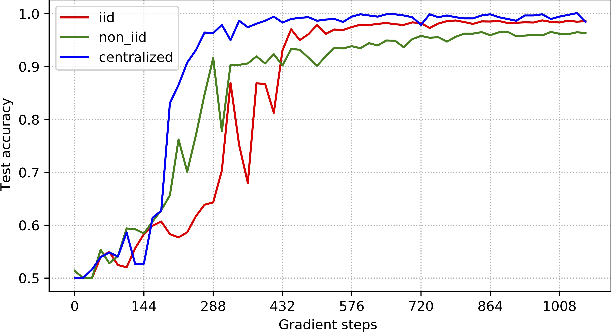

### Federated learning on the simulated surface-enhanced Raman spectra
This repository provides the implementation of FedAvg on top of the simulated surface-enhanced Raman spectra. 

#### Requirement 
```bash
git clone https://github.com/lyn1874/fedsers.git
cd sers_fl
conda env create -f sers_fl.yaml
conda activate torch_dl
```

#### Data preparation

We generate the SERS maps using the function `save_data()` from the file `data.prepare_sers_data.py`. Basically, different types of SERS maps can be generated using the function `save_data()`. For example, pure SERS maps, SERS maps with contaminants at a fixed Raman wavenumber, and SERS maps with contaminants at different Raman wavenumber. In this experiment, we simply use the SERS maps without any contaminants. 


#### Training
We train fedavg using the following command
```bash
sbatch brun.sh
```

#### Result


#### Citation
If you use the data generator, please cite:

```
@Article{D3AN00446E,
author ="Li, Bo and Zappalá, Giulia and Dumont, Elodie and Boisen, Anja and Rindzevicius, Tomas and Schmidt, Mikkel N. and Alstrøm, Tommy S.",
title  ="Nitroaromatic explosives’ detection and quantification using an attention-based transformer on surface-enhanced Raman spectroscopy maps",
journal  ="Analyst",
year  ="2023",
volume  ="148",
issue  ="19",
pages  ="4787-4798",
publisher  ="The Royal Society of Chemistry",
doi  ="10.1039/D3AN00446E",
url  ="http://dx.doi.org/10.1039/D3AN00446E",
}
```
